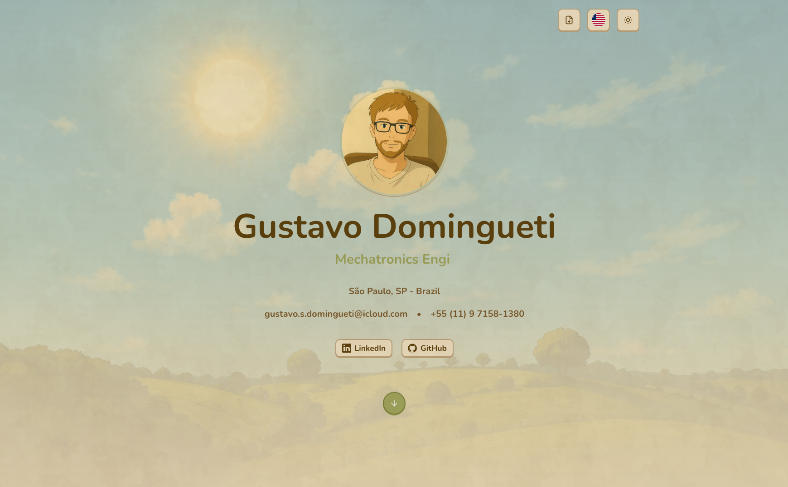
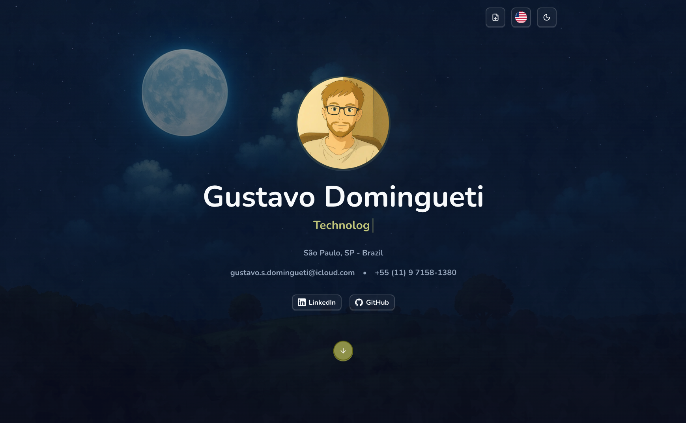
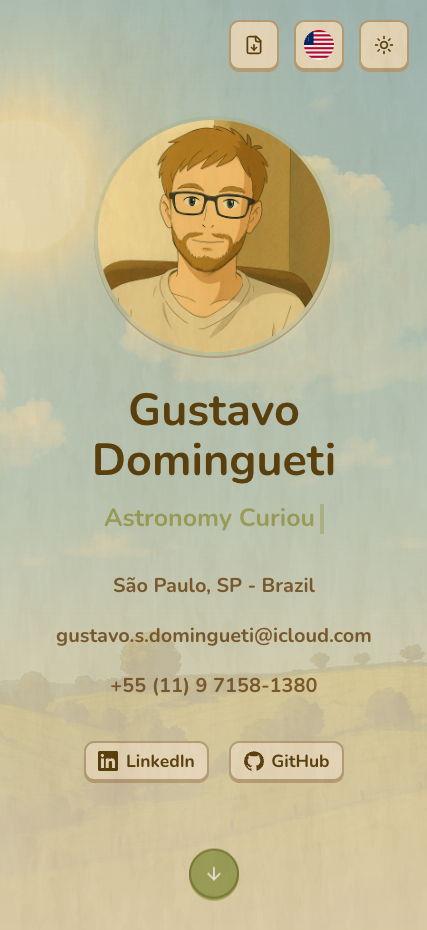
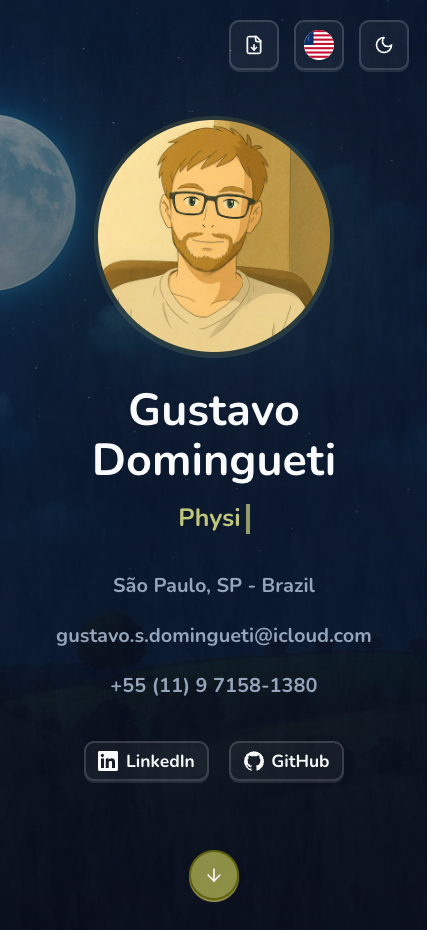

<h1>Portfolio</h1>

<p align="center">
  <a href="https://nodejs.org/en/" target="_blank">
    
  </a>
  <a href="https://www.npmjs.com/" target="_blank">
    
  </a>
  <a href="https://react.dev/" target="_blank">
    
  </a>
  <a href="https://www.linkedin.com/in/gustavo-domingueti/" target="_blank">
    
  </a>
</p>

<h3 align="center">
  <a
    href="https://gustavodomingueti.com.br"
    target="_blank"
  >Access the portfolio</a>
</h3>

## Table of Contents

- [About](#about)
- [Features](#features)
- [Technologies and libraries](#technologies)
- [Best Practices & Tooling](#best-practices-and-tooling)
- [Project Structure](#project-structure)
- [How to Use](#how-to-use)

<a id="about"></a>

## :bookmark: About

A modern and professional portfolio website built with Next.js, React, and TypeScript. This project showcases skills, projects, and experience with a beautiful UI, animations, and responsive design.

<a id="features"></a>

## :dart: Features

- Modern and responsive UI
- Dark mode support
- Smooth animations with Framer Motion
- Toast notifications
- Accessible components with Radix UI
- Type-safe development with TypeScript
- Beautiful UI with Tailwind CSS
- Internationalization with next-intl
- Analytics with Vercel Analytics and Speed Insights

<a id="technologies"></a>

## :rocket: Technologies and libraries

The project was developed using the following technologies and libraries:

- [Next.js](https://nextjs.org/) - The React Framework for the Web
- [React](https://react.dev/) - A JavaScript library for building user interfaces
- [TypeScript](https://www.typescriptlang.org/) - JavaScript with syntax for types
- [Tailwind CSS](https://tailwindcss.com/) - A utility-first CSS framework
- [Radix UI](https://www.radix-ui.com/) - Unstyled, accessible components
- [Framer Motion](https://www.framer.com/motion/) - A production-ready motion library for React
- [next-themes](https://github.com/pacocoursey/next-themes) - Dark mode with Next.js
- [next-intl](https://next-intl-docs.vercel.app/) - Internationalization for Next.js
- [Sonner](https://sonner.emilkowal.ski/) - Toast notifications
- [Lucide React](https://lucide.dev/) - Beautiful & consistent icons
- [Vercel Analytics](https://vercel.com/analytics) - Analytics for Next.js

<a id="best-practices-and-tooling"></a>

## :white_check_mark: Best Practices & Tooling

This project follows modern best practices to ensure code quality, consistency, and maintainability:

- [Husky](https://typicode.github.io/husky/get-started.html) Automates pre-commit hooks to enforce standards before pushing changes.
- [ESLint](https://eslint.org/) Ensures consistent code quality by identifying and fixing linting issues.
- [Prettier](https://prettier.io/) Automatically formats code to maintain a uniform style.
- [Commitlint](https://commitlint.js.org/) Enforces a standardized commit message format.
- [Lint-staged](https://github.com/lint-staged/lint-staged) Runs linters on staged files before committing, ensuring only formatted and checked code is pushed.

<a id="project-structure"></a>

## :open_file_folder: Project structure

```
/portfolio
├── app/                     # App router with page components
│   ├── [locale]/            # Internationalized routes
│   ├── api/                 # API routes
│   ├── favicon.ico          # Favicon
│   └── globals.css          # Global styles and CSS
├── components/              # Shared React components
│   ├── ui/                  # UI components built with Radix UI
│   └── ...                  # Other components
├── constants/               # Shared constants
├── emails/                  # Template emails to send using Resend library
├── i18n/                    # I18n configuration using next-intl
├── lib/                     # Shared libraries, helpers, and integrations
├── sections/                # Page sections
├── types/                   # TypeScript type definitions
├── utils/                   # Utility functions and helper methods
├── next.config.mjs          # Next.js configuration
├── tsconfig.json            # TypeScript configuration
├── package.json             # Project dependencies
└── README.md                # Project documentation
```

## :heavy_check_mark: :computer: Desktop Result

<h1 align="center">
    
    
</h1>

## :heavy_check_mark: :iphone: Mobile Result

<h1 align="center">
    
    
</h1>

<a id="how-to-use"></a>

## :fire: How to use

- ### **Prerequisites**

  - It is **necessary** to have **[Node.js](https://nodejs.org/en/)** installed on the machine.
  - Also, you **need** to have a package manager be it **[NPM](https://www.npmjs.com/)** or **[Yarn](https://yarnpkg.com/)**.

1. Clone the repository:

```sh
  $ git clone https://github.com/dominguetigs/portfolio.git
```

2. Run the Application:

```sh
  # Install the dependencies
  $ npm install

  # Initialize the application
  $ npm run dev

  # Build the application
  $ npm run build

  # Start the built application
  $ npm run start
```

## :memo: License

This project is under the MIT license. See the [LICENSE](LICENSE.md) file for more details.

---

<h4 align="center">
    Made with 💙 by <a
      href="https://www.linkedin.com/in/gustavo-domingueti/"
      target="_blank"
    >Gustavo Domingueti</a>
</h4>
